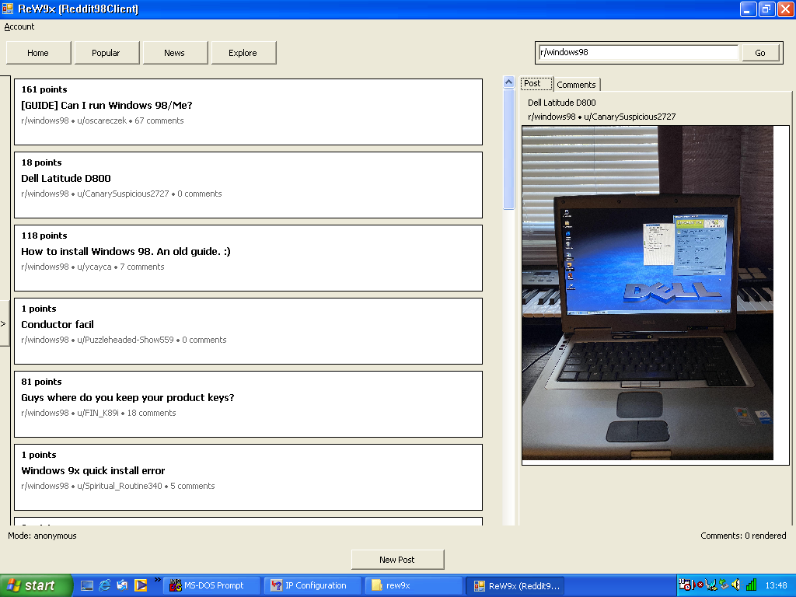
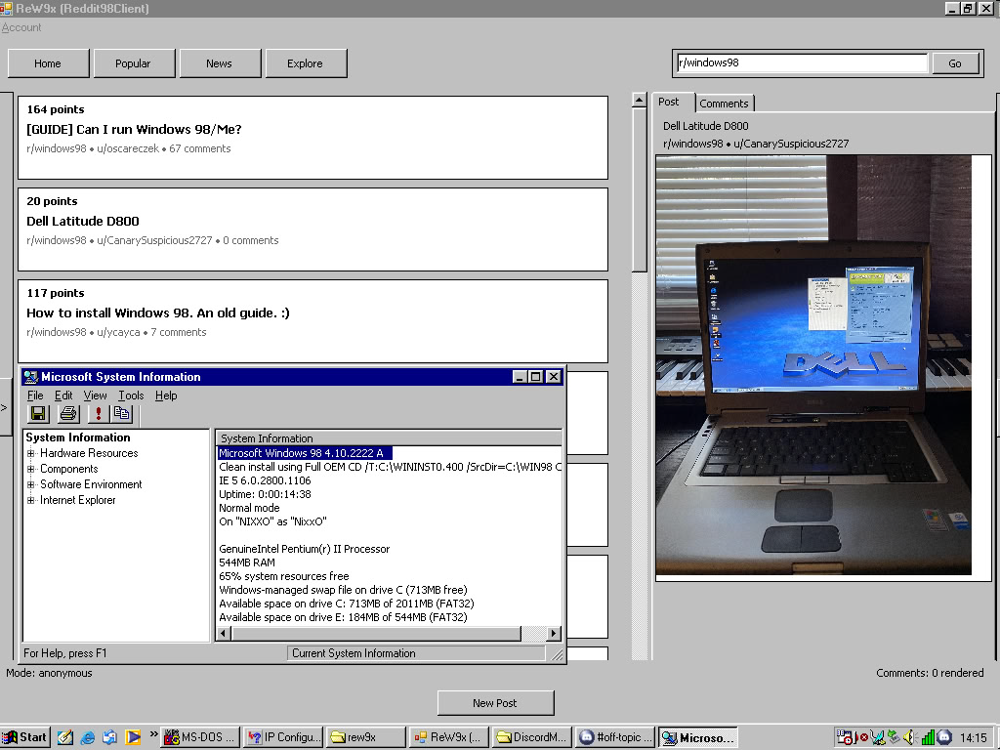
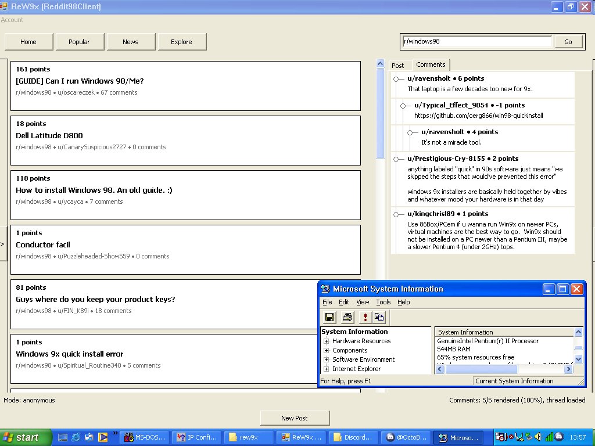

# [WIP] ReW9x (Reddit98Client)

ReW9x is a lightweight Reddit client for old Windows systems, focused on keeping basic Reddit reading usable on Windows 9x-era machines.

> [!CAUTION]
> This project already has a usable reader flow, but it is still rough software.
> Expect UI quirks, unfinished flows, and layout bugs that need more polishing.

## Screenshot





## Disclaimer

> This is an unofficial third-party Reddit client.
>
> Reddit's API policies, rate limits, and platform rules may change over time.
> Use this client at your own risk. The author and contributors are not
> responsible for Reddit account issues, API access changes, or service-side
> breakage caused by policy changes outside this repository.

## Features

### Implemented

- Anonymous mode
- Saved-account mode with refresh-token reuse
- Feed navigation:
  - `Home`
  - `Popular`
  - `News`
  - `Explore`
- Topic drawer with subreddit list
- Subreddit navigation from search and topic list
- Mixed search popup:
  - subreddit/community matches
  - post search results
- Post reading
- Comment viewing
- Inline image preview for supported image posts
- Separate image viewer window for larger image viewing

### Partially Implemented / Rough Edges
- Reddit OAuth login via manual authorization-code flow
- Search UX still needs more polish
- Search popup behavior is functional but still evolving
- Topic drawer sizing/layout is still being tuned
- Some shell interactions are approximations of modern Reddit behavior
- UI layout can still behave badly in resize/edge cases

### Planned / TODO
- Better search UX and result presentation
- More shell/layout polish
- Better subreddit/topic navigation
- A real posting flow beyond the current stub
- Parsing embed content from post/news

## Building (Linux)

### Build Prerequisite: `native_tls.dll`

Before building the main client, you must have a working toolchain that can
build the native TLS bridge DLL.

The wrapper DLL depends on:

- a working MinGW toolchain suitable for old Windows targets
- a working OpenSSL build

If your normal MinGW toolchain does not produce a usable DLL for Win9x-era
targets, read the wrapper-specific notes here:

- [`external/openssl_wrp/README.md`](external/openssl_wrp/README.md)

The toolchain used for this project was built from the Discord Messenger guide:

- https://github.com/DiscordMessenger/dm/tree/master/doc/pentium-toolchain

You should also set `MINGW_CC` manually to the exact compiler from that
toolchain.

Do not rely on a random `i686-w64-mingw32-gcc` from your system PATH if you are
targeting old Windows builds. Using the wrong compiler can produce a
`native_tls.dll` that builds successfully but crashes or misbehaves on older
systems.

For example:

```bash
export PATH="$HOME/mingw-builds/install/cross/bin:$PATH"
MINGW_CC=i686-w64-mingw32-gcc OPENSSL_DIR=$HOME/src/openssl bash build.sh
```

`build.sh` already tries to build `native_tls.dll` automatically, but this only
works if that toolchain, the explicit `MINGW_CC`, and the OpenSSL build are all
set up correctly.

Build the client with:

```bash
MINGW_CC=i686-w64-mingw32-gcc OPENSSL_DIR=$HOME/src/openssl bash build.sh
```

The build script:

- builds `build/native_tls.dll`
- builds `build/ReW9x.exe`
- copies the required runtime files into `build/`

The final executable is:

```text
build/ReW9x.exe
```

## Running

Example Wine launch:

```bash
WINEPREFIX=... wine build/ReW9x.exe
```

## Project Layout
- `src/app/` - entry point and app config
- `src/api/` - Reddit API client logic
- `src/models/` - domain models
- `src/ui/` - WinForms UI
- `src/utils/` - parser/storage/shared helpers
- `external/openssl_wrp/` - OpenSSL wrapper sources
- `external/openssl_wrp/runtime/` - runtime DLLs and CA bundle copied into `build/`
- `build/` - generated executable and runtime assets

## OAuth Setup

Before building, edit:

[`src/app/app_config.cs`](/home/nixxo/build/win98/src/reddit98/src/app/app_config.cs)

You need to set:

- `ClientId`
- `RedirectUri`

The intended Reddit application type is:

- `installed app`

The client uses a manual callback flow:

1. Open the authorization URL in a normal browser
2. Sign in and approve access
3. Copy the redirected callback URL
4. Paste that callback URL back into the client

The `redirect uri` on Reddit's side must match the value in
`src/app/app_config.cs`.

The account state is stored in:

```text
account.json
```

This file is local runtime state and is not intended to be versioned.

## Runtime Files

The final `build/` directory is expected to contain:

- `ReW9x.exe`
- `native_tls.dll`
- `libssl-3.dll`
- `libcrypto-3.dll`
- `providers/legacy.dll`
- `cacert.pem`

These are sourced from:

```text
external/openssl_wrp/runtime/
```

## Notes
...

## Credits

- OpenSSL build/source used for this project:
  https://github.com/DiscordMessenger/openssl
  
